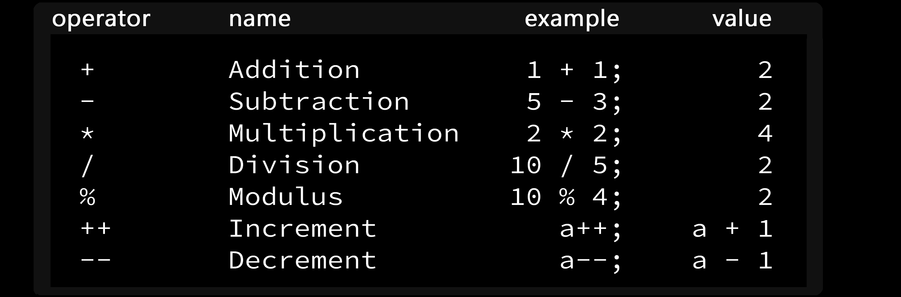
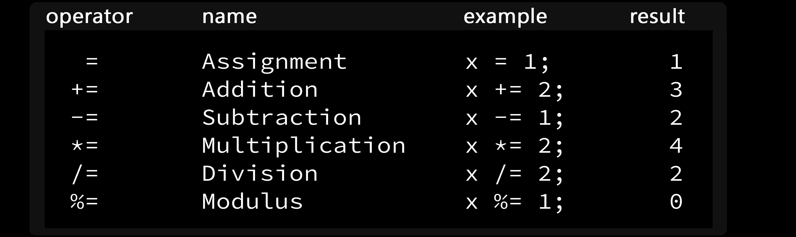
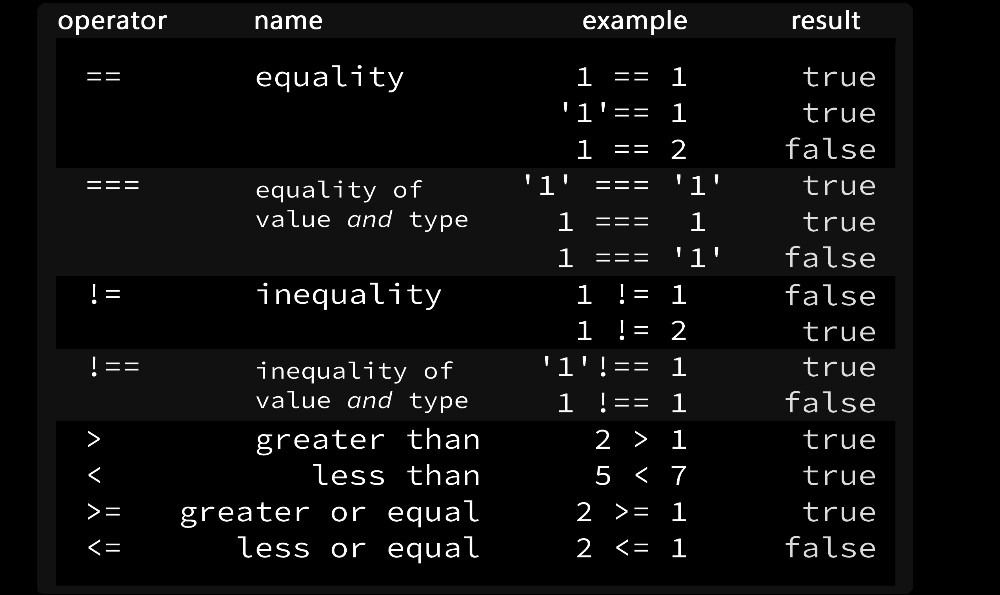
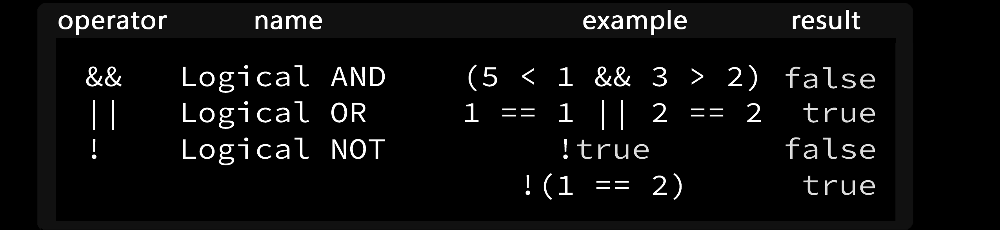
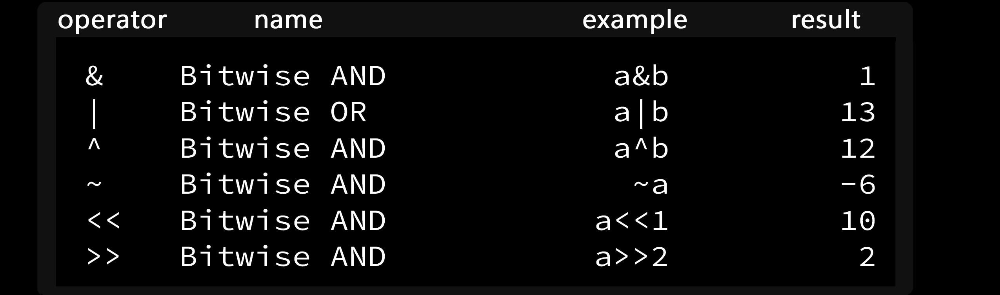
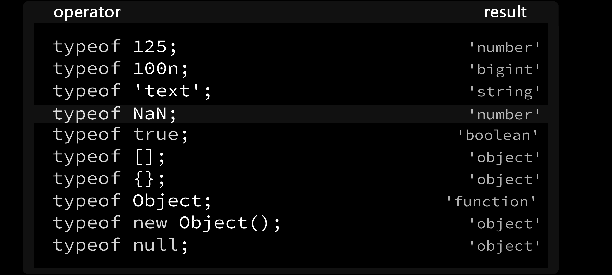

# java script working #

## #1 Everything in javascript happens inside an "Exection context " ##
### Execution Context ###
* Execution context is like a box.It has two components.
* 1)Memory component or Variable environment.
* 2)code component or thread of execution.
###  Memory component ###
* It is the environment where all the variables and functions are stored as key-value pairs.
### Code compoent  ###
* This is the place  where  code is executed one line at a time


i


##  #2 Javascript is a synchronous singe-threaded language ##
* Single-thread --> javascript can execute one command at a time.
* Synchronous --> Javascript can execute one command at a time in a specific order.

## chapter 6  ##
### Type coersion  ###
* When + operator encounters objects of incompatible type, it will attempt to coerce those objects to their values in string format.
* Example:
```javascript 
 console.log(null + {} +true + [] + [5]);  //return .toString() result  for each 
 ```
### Type coersion in Boolean constructors  ###
* Meaningless values still evaluate to either true or false, because these are the only values available for boolean types.
```javascript
let a =Boolean(true);
console.log(a);
let b =Boolean([]);
console.log(b);
let c = Boolean({});
console.log(c);
let d= Boolean(false);
console.log(d);
let e = Boolean(NaN);
console.log(e);
let f =Boolean(null);
console.log(f);
let g = Boolean (Infinity);
console.log(g);
let h = Boolean (undefined);
console.log(h);
let i = Boolean ('');
console.log(i);
let j = Boolean (0);
console.log(j);  
```
* Output:
```javascript 
true
true
true
false
false
false
true
false
false
false
```
### Type coersion  ###
* Coercion is the process of converting a value from one type into another. For
example, number to string, object to string, string to number (if the entire string
consists of numeric characters) and so on...

* The unary plus and minus operators force the value to a number. If the value is not a number, NaN is generated:

* This rule is specific to the unary operator.

```javascript 
//Unary minus , plus type coersion (String to Unary number)
const s ="text";
console.log(s);             //normal
console.log(+s);            //Can't change to number so returns NaN
console.log(-s);             //Can't change to number so returns NaN
```
* Output:

```javascript 
text
NaN
NaN
```
### Number and String arithematics ###
* Let us consider + operator : It behaves in three different ways as below
```javascript
//Sring and number arithematic in + operator
1 + 2;            // + as arithematic
"hello" + "JS" ;     // + as String arithematic
+1 + -12;            // + Unary and arithematic

// opearor +  in string and number
"hello" + 20;   // It converts the  numeric as string and prosuce string o/p
 ```

 *Output:
 ```javascript
 1+2;
3
"hi" + "hello"
'hihello'
+12 + -56;
-44 
 ```

 ```javascript
"hello" + 20;
'hello20'
 ```

 ## Operator Precedence & Associativity Table ##
 *  L-value and R-value 
 ### Assignment Operator ###
The assignment operator takes the R-value and transfers it over to L-value, which
is usually a variable identifier name.
 ### Arithmetic Addition Operator ###
But the arithmetic addition operator takes the L-value and adds R-value to it:

 ### null vs undefined  ###

*  Think of null as a unique type for explicitly assigning a ”nothing” or ”empty”
value to a variable. This way it doesn’t end up undefined.

* The null keyword is used to assign a temporary default value to a variable before
it’s populated with actual object data at a later time in your program.

```javascript
//   assigning a variable to nothing will produce undefined
let bike ;
console.log(bike);

// Assigning a variable to undefined will produce undefined

let motor = undefined;
console.log(motor);

//Assinging a unknown value to null ,we can update the value later in program

let cycle=null;
console.log(cycle);
```

```javascript 
Output:
undefined
undefined
null
```
## Initialize or Update in null ##
* consider the following situation which is initializing and later updating will not be undefined at any cost if we declare it as null
```javascript
// assigning null to a variable and create a new object for it later will not affect it.

let plane =null;

class helicopter{

    constructor(make,model,year){
        this.make=make;
        this.model=model;
        this.year=year;
        this.features = null;
    }
     getFeatures(){
         if (this.features==null)
         {
              console.log(this.features);    //calling original value
            
         }
         else 
         {
             this.features=2;
             console.log(this.features);    //updating the value.
             
            }
         
     }
    }

plane = new helicopter("AirIndia","AR005",2022);
plane.getFeatures();
```

* Output:
```javascript
null
```

# Chapter 7 #

# Scope #

* Scope is simply the area enclosed by {} brackets.
*  But be careful not to confuse it with the identical empty object-literal syntax.
* There are 3 unique scope types:
* The global scope.
*  block scope .
* function scope.

## Scoping in variable definitions ##
# Case-Sensitivity #
* A and a are not same

```javascript
let a=5;
console.log(a);
let A="hi";
console.log(A);
```
* Output:
```javascript
5
hi
```
# explore variable definitions using var keyword and hoisting #
 * When a variable is defined in global scope using var keyword, it also automatically becomes available as a property on window object.
 ```javascript
 //Global scope

var apple=5;    

console.log(apple);           //Using in global

function add(){

    apple =apple+2;        //Using inside a function
    console.log(apple);
}
add();

 ```

 * Output

 ```javascript
 5
7
 ```

 ## Block scope ##

 * Generally speaking, whenever you see {curly brackets}, it is a block.
 * A block scope is the area within if, switch conditions or for and while loops.
* declaring a variable inside block scope will hoist to global scope.

```javascript

//Block scope
console.log(c);

if(true){
    var c=50;             // First declaration inside the block
}
```
* But output is undefined now

```javascript
undefined
```

## Hoisting ##
* Hoisting simply means ”raised” or ”placed on top of”.
* It means that accessing(invoking or calling) functions or variables before we initialize it without error.
* Hoisting is limited to variables defined using var keyword and function name de-fined using function keyword.
###  Function Name Hoisting ###
* We can call function without defining it (It is legal)
```javascript

fun();            //Function call befor function defintion

function fun(){
    console.log("hi");
}


```

* Output:
```javascript
hi
```

### Anonymous function and function hoisting property ###
* It’s important to note, however, that anonymous functions that were assigned to variable names are not hoisted unlike named functions.
* Example:
```javascript

//Anonymus functions and hoisting

function sun(){
    console.log("First function");
}

var sun = function(){
    console.log("Anonymous function [second funcion]");
}

sun();     // calls the second function (Overwritten)

```

* Output:
```javascript
Anonymous function [second funcion]
```
## Procedence ##
* If we have two functions with same name,then we call the function second one will be executed
```javascript
function sun(){
    console.log("First function");
}

function sun(){
    console.log("Second function");
}


sun();     // calls the second function (Overwritten)

```

*Output:
```javascript
Second function
```

* If we have one function and another anonymous with same name ,then caling will produce the anonymous functions result not the second one
```javascript
function sun(){
    console.log("First function");
}
var sun = function(){
    console.log("Anonymous function");
}

function sun(){
    console.log("Second function");
}


sun();

```
* Output:
```javascript
Anonymous function
```

## Defining Variables Inside Function Scope ##
* At this point you might want to know that variables defined inside a function will be limited only to the scope of that function. 
* Trying to access them outside of the function will result in a reference error:

```javascript

// Declaring variables inside function and not using them globaly
function jail(){
    var accust_name="sugan";
    console.log(accust_name);
}
jail();
```
* Output:
```javascript
sugan
```
```javascript
// Declaring variables inside function and Using them globally will produce reference error
function jail(){
    var accust_name="sugan";
    console.log(accust_name);
}
jail();

console.log(accust_name);   //creates error message
```
  
* Output:
```javascript
sugan
/home/guest/Documents/javascript/scope.js:69
console.log(accust_name);   //creates error message
            ^

ReferenceError: accust_name is not defined

```
## Simple scope accessibility rules: ##
* Rule:1 The variable declared in global will be accessed in anywhere in the program

```javascript
//Simple scope accessibility rules:

var rule=5;            //Declaring globally

console.log(rule);    // Using it globally

if(true)
{
    rule=2;               //Using it in block
    console.log(rule);
}

function show(){             //Using it in function
    rule=4;
    console.log(rule);
}
show();

```
* Output:

```javascript
guest@stalin:~/Documents/javascript$ node scope.js
5
2
4
```

* Rule :2  --> The variable declared inside a block can also use it anywhere 
* NOTE: The result will vary according to the position the variable is used

```javascript

if(true)
{

   var rule;            //Declaring block

    rule=2;               //Using it in block
    console.log(rule);
}

function show(){             //Using it in function
    rule=4;
    console.log(rule);
}
show();

console.log(rule);    // Using it globally
```

* Output:

```javascript
guest@stalin:~/Documents/javascript$ node scope.js
2
4
4
```

* Rule:3 --> Defining variables inside function scope is basically one way street ordeal. 
* Nothing can leave the confines of a function into its parent scope.

```javascript

function show(){             

   var rule;            //Declaring inside a function
    rule=4;
    console.log(rule);       //Using it in function
}
show();

console.log(rule);    // Using it globally
```
* Output:
```javascript
guest@stalin:~/Documents/javascript$ node scope.js
4
/home/guest/Documents/javascript/scope.js:90
console.log(rule);    // Using it globally
            ^

ReferenceError: rule is not defined
```

## Variable Types ##
* The keywords var, let and const do not determine the variable’s type. Instead, they determine how the variable can be used:
* var    --> For the most part it is still available but only to support legacy code.
* let    --> let defines a variable but limits its use to the scope in which it was defined.
* const  --> const is the same as let but you can’t re-assign it to a new value once defined.

#  Scope Visibility Differences  #

##  No Difference In Global Scope ##

*  When variables are defined in global scope there is no differences between var, let and const in terms of scope visibility.

*  They all propagate into inner block-level, function-level and event callback scopes:

```javascript

// let ,var and const are same in global scope

 var monday=1;

 let tuesday=2;

 const wednesday=3;

 console.log(monday,tuesday,wednesday);    ///using globally

 function week(){
 
     console.log(monday);                //Using inside a function
     
 
     console.log(tuesday);

     console.log(wednesday);
 }
week();
```

* Output:

```javascript
guest@stalin:~/Documents/javascript$ node scope.js
1 2 3
1
2
3
```
## Keywords let and const limit variable to the scope in which they were defined: ##

```javascript
// let , const and var in block scope

if(true){                   
    var jan=1;                   ///Declaring in block-scope
    let feb=2;
    const mar=3;
     
    console.log(jan,feb,mar);      
}
console.log(jan);           //var will log the value
                       
console.log(feb);           //let  will give reference error

console.log(mar);           //const will also give reference error   
```
* Output:
```javascript
guest@stalin:~/Documents/javascript$ node scope.js
1 2 3
1
/home/guest/Documents/javascript/scope.js:128
console.log(feb);           //let  will give reference error
            ^

ReferenceError: feb is not defined
```

## Variables defined using let and const are not hoisted. Only var is ##
* Hoisting means that using variables even before initializing it
### 1.Hoisting var  ###
 * It will produce default keyword undefined because it onloy allocates placeholder
 ```javascript
 //Hoisting var

console.log(jun);
var jun=55;
 ```

 * Output:
 ```javascript
 guest@stalin:~/Documents/javascript$ node scope.js
undefined
 ```

### 2.Hoistig let and const ###
* It will produce an reference error as let and const will allocate memory in seperate place not in global in execution context.
```javascript
//Histing let
console.log(jul);
let jul=34;

```
* Output:
```javascript
console.log(jul);
            ^

ReferenceError: jul is not defined
```
* Same reference errpr will be come for const also.

## In Function Scope all variable types, including var remain limited to their scope ##
* We cannot access variables outside of the function scope in which they were defined regardless of which keyword was used.
```javascript
// let, var and const are same in function scope

function games(){
    var football=1;              //declaring inside functons
    let cricket=2;
    const hockey=3;

    console.log(football);        //can work inside a function
    console.log(cricket);          
    console.log(hockey);
}
games();

console.log(fotball);          //cannot acces it globaly
```
* Output:
```javascript
guest@stalin:~/Documents/javascript$ node scope.js
1
2
3
/home/guest/Documents/javascript/scope.js:165
console.log(fotball);
```
* The same referece error will be thrown to the other let and const also.


## Closures  ##

* A function closure is a function trapped inside another function:

* Function along with it,s lexical scope forms closure.

```javascript
 var plus =  function (){
    var counter=0;
      return function() {
        counter +=1;
        return counter;
    }

} 
();

console.log(plus());
console.log(plus());
console.log(plus());
```

* Output:

```javascript
guest@stalin:~/Documents/javascript$ node closure.js
1
2
3
```
## Class scope ##

* The class scope is simply a placeholder. Trying to define variables directly in class scope will produce an error

```javascript
class cat {
    let property=1;     //will produce error
    this.property=2;
}
```

* Output:
```javascript
guest@stalin:~/Documents/javascript$ node class.js
/home/guest/Documents/javascript/class.js:2
    let property=1;
        ^^^^^^^^

SyntaxError: Unexpected identifier

```

* In class methods, let (or var or const) only create a local variable to that scope.
* Therefore, it cannot be accessed outside of the method in which it was defined.

```javascript
class cat{
    constructor(){
        let property=1;
        this.something=2;

    }
    methods(){
       
        console.log(this.property);
        console.log(this.something);
    }
}

const a = new cat();

a.methods();
```

* Output:

```javascript
undefined
2
```
## const keyword ##

* The const keyword is distinct from let and var.
* It requires assignment on definition

```javascript
const a;   //shows error
```

* Output:
```javascript
/home/guest/Documents/javascript/const.js:4
const a;   //shows error
      ^

SyntaxError: Missing initializer in const declaration
```
* Reason: value of const cannot be reassigned

```javascript
const b =10;
b=12;
console.log(b);
```
* Output:
```javascript
b=12;
 ^

TypeError: Assignment to constant variable.
```

* CORRECT METHOD:
```javascript
const b =10;   // no error
```
### const and Arrays ###

* Can’t assign any new objects to the original variable name again.

```javascript
const c=[];
c[0]=276;
c[1]=356;
c[2]=456;
console.log(c);
 c = [];         //  reassigning is not allowed
```
* Output:
```javascript
[ 276, 356, 456 ]
/home/guest/Documents/javascript/const.js:16
 c = [];
   ^

TypeError: Assignment to constant variable.
```

### const and Object Literals  ###
* We can't reassign the object but can acces the properties and methods within it

```javascript
 const obj ={
     property : 1 ,
     display : function (){
         console.log("hi")
     }
   
 }                              //Normal object with const keyword

 console.log(obj);              //prints available object

 obj.display();                   //Prints display function

 obj.property=3;           
 console.log(obj);    //We can update the property      

obj.display =  () => {
    console.log("hello");       //We can update the function
}
obj.display();

obj={                          //But we can't reassign ,It will show error
    property :35,
    show : function(){

    }
}
```

* Output:
```javascript
{ property: 1, display: [Function: display] }
hi
{ property: 3, display: [Function: display] }
hello
/home/guest/Documents/javascript/const.js:40
obj={                          //But we can't reassign ,It will show error
   ^

TypeError: Assignment to constant variable.
```

# Chapter 7: Operators #
<br>

## Arithmetic Operators ##
<br>



## Assignment Operators ##
<br>




## String ##
<br>


## Comparison Opearors ##
<br>



<br>

## Logical Operator  ##
<br>



* Logical AND (&&)

* it performs * operation that means,

   
   * 0 0 --> 0
   * 0 1 --> 0
   * 1 0 --> 0
   * 1 1 --> 1

* In other words, If both conditiona are true, only Result is true.

* Logical OR (||)

* it performs + operation that means,

         
   * 0 0 --> 0
   * 0 1 --> 1
   * 1 0 --> 1
   * 1 1 --> 1

* In other words if any one of the condition is true the result is true.

* Logical NOT (!)

     * 0 --> 1
     * 1 --> 0

 * In other words Just opposite.


<br>

## Bitwise Opeartor ##
<br>




<br>

* Bitwise opeartors converts  the numbers to binary format and performs bitwise operations.


* 1- Bitwise AND ( & )

* Example:

 ```javascript
 //Bitwise AND

let a=3;         //converted  as 0011

let b=5;           //coverted as 0101

console.log(a & b);       // res 0001  --> 1
 ```

 * Output:
 ```javascript
 guest@stalin:~/Documents/javascript$ node operators.js
1
 ```

* 2- Bitwise OR ( | )

* Example:

 ```javascript
 
//Bitwise OR

let c=10;              // converted as 1010

let d= 8;              // converted as 1000

console.log(c | d)             // res 1010  --> 10
```

 * Output:

 ```javascript
 guest@stalin:~/Documents/javascript$ node operators.js

10

 ```


* 3- Bitwise XOR ( ^ )

* Example:

 ```javascript
 //Bitwise XOR

let e=6;              // converted as 0110

let f= 9;              //converted as 1001

console.log(e ^ f)             // res 1111 -->  15
 

```

 * Output:

 ```javascript
 guest@stalin:~/Documents/javascript$ node operators.js

15

```

* 4- Bitwise NOT ( ~ )

* Explanation:

   * The 32-bit signed integer operand is inverted according to two's complement. That is, the presence of the most significant bit is used to express negative integers.

   * Bitwise NOTing any number x yields -(x + 1). For example, ~-5 yields 4.

   * Note that due to using 32-bit representation for numbers both ~-1 and ~4294967295 (2^32 - 1) results in 0
    


* Example:

 ```javascript
 //Bitwise NOT

let g=5;              // converted as 00000000000000000000000000000101 (5)
                      // Since JavaScript uses 32 bits signed integers


console.log( ~g)      // res 11111111111111111111111111111010 (~5 = -6) 

```

 * Output:

 ```javascript
 guest@stalin:~/Documents/javascript$ node operators.js

-6

```
* 5- Bitwise Left shift ( << )
 * The << operator is the same as multiplying a whole number by 2

* Example:

 ```javascript
 //Bitwise Leftshift

let h=5;              // converted as 00000000000000000000000000000101 (5)
                      // Since JavaScript uses 32 bits signed integers


console.log( h << 1)  // 00000000000000000000000000000101  (5)
                      // 00000000000000000000000000001010  (1 left shift of 5) --> 10

 
 ```

 * Output:

 ```javascript
 guest@stalin:~/Documents/javascript$ node operators.js
10

```
* 5- Bitwise Right shift ( >> )
 * The >> operator is the same as dividing a whole number by 2

* Example:

 ```javascript
 //Bitwise Rightshift 

let i=5;              // converted as 00000000000000000000000000000101 (5)
                      // Since JavaScript uses 32 bits signed integers


console.log( h >> 1)  // 00000000000000000000000000000101  (5)
                      // 00000000000000000000000000000010  (1 right shift of 5) --> 2

```

 * Output:

 ```javascript
 guest@stalin:~/Documents/javascript$ node operators.js
2

```
<br>

## typeof Opeartor ##

* The typeof operator is used to check the type of a value. 

* It will often evaluate to either primitive type, object or function.

<br>



<br>

## Ternary (?:) ##

* The ternary operator has the form of: <b> statement ? statement : statement </b>

* Statements can be expressions or a single value

* NOTE :  It does not support {} brackets or multiple statements.


 ```javascript

// ternary

 let z = (1===1) && (0==1) ? console.log("hi") : console.log("hello");

```
* Output:
 ```javascript

hello

```

## delete ##

* The delete keyword can be used to delete an object property

```javascript
//delete

let obj={
    initial : "S",
    Name : "Vijay",
    Age:20
}
console.log(obj);     //Before delete
delete obj.Name;
console.log(obj);      //After delete
```

* Output:

```javascript
{ initial: 'S', Name: 'Vijay', Age: 20 }
{ initial: 'S', Age: 20 }
```

* We cannot use delete to remove stand-alone variables.

```javascript
let variable =29;
console.log(variable);  //before deleting
delete variable;
console.log(variable);   // After delete

```
* Output:

```javascript
29
29     // Not deleted
```

* In Strict mode error message is thrown

*  Console Output:

 * VM35:3 Uncaught SyntaxError: Delete of an unqualified identifier in strict mode

## in ## 

* The in operator can be used to check if a property name exists in an object

```javascript
// in

let sorry = {
    name :"vijay"
}
console.log("name" in { name : "vijay"});

```

* Output:

```javascript
true

```
* The in operator, when used together with arrays, will check if an index exists.

```javascript
// in

let array = [ 1 , 2,  "hi" ];
console.log(0 in [ 1 , 2,  "hi" ] );
console.log(1 in [ 1 , 2,  "hi" ] );
console.log(2 in [ 1 , 2,  "hi" ] );
console.log(3 in [ 1 , 2,  "hi" ] );

```
* Output:

```javascript
true
true
true
false

```

* You can check for properties on built-in data types. The length property is nativeto all arrays
```javascript
let array = [ 1 , 2,  "hi" ];
console.log("length" in array);
```
```javascript
true

```
* The ”length” property does not exist natively on an object unless it’s added ex-plicitly:

```javascript
let obj2={
    name: "vijay",
    age:2
}

console.log("length" in obj2);
console.log("length" in {"length" :1});

```
* Output:

```javascript
false
true

```

* Check for presence of constructor or prototype property on an object constructor function

```javascript
function obj3(){
    this.name="vijay",
    this.age=20
}

const obj4 = new obj3();

console.log(obj4);

console.log("constructor" in obj3 );
console.log("prototype" in obj3);

```

* Output:

```javascript
true
true

```

# Chapter : 9     #
# ...rest and ...spread # 

## Rest and Spread Properties ##

* The rest syntax is called rest parameters, in the context of using it as a parameter name in a function definition, where it simply means: ”the rest of arguments”.

* Sometimes it is referred to as rest elements, because it assumes multiple values.

* ...rest parameter – collect all remaining parameters (”the rest of”) into an array.

* Example :

* Let us consider a simple sum function

```javascript
function sum(a,b){
    return a+b;
}
console.log(sum(1,6,));
```
* Output:
```javascript
7
```

* The ...rest parameters can gather an unknown number of arguments passed to the function and store them in an array (named args in this example)

```javascript
function sum(...args){
    console.log(args);
}
sum(1,3,5,6);
```
* Output:
```javascript
guest@stalin:~/Documents/javascript$ node rest.js
[ 1, 3, 5, 6 ]
```
* ...rest should be used as a last parameter if it is not ,it will show error

```javascript
function sum(...args,a,b){
    console.log(args);
}
sum(1,3,5,6);
```
* Output:
```javascript
/home/guest/Documents/javascript/rest.js:23
function sum(...args,a,b){
                    ^

SyntaxError: Rest parameter must be last formal parameter

```
* If we pass array as argument , it will consider as array
```javascript
function sum(...args){
    console.log(args);
}
sum([1,3,5]);
```
* Console Output:
```javascript
[Array(3)]
0: (3) [1, 3, 5]
length: 1
[[Prototype]]: Array(0
```
### Overlap of ...spread and ...rest ###

## Ex:1 ##
```javascript
function print(a,...args){
    console.log(a);
    console.log(args);
}
print(...[1,2,3],4,5);

```
* Output:
```javascript
1
[ 2, 3, 4, 5 ]
```

* Here, first ...spread forms a complete list of arguments: 1, 2, 3, 4, 5 and that’s what’s passed into the print function. 

* Inside the function, a equals 1, and [2, 3, 4, 5] is ”the rest of” arguments.


## Ex:2 ##

```javascript
function print2(a,b,c, ...args){     //...rest utilize the  remainig
   console.log(a);
   console.log(b);
   console.log(c);
    console.log(args);
}
print2(...[24,56],1,2,3,5,6);    //...spread attaches elements to list 

```
  * Here ...spread attaches the array [24,56] to the excisting list of aruments.
  * So the arguments are: [24,56,1,2,3,5,6]
  * Inside a function we are printing a,b,c and args
  * a=24,b=56,c=1 and args=remaing of a,b,c so [2,3,5,6]

* Output:

```javascript
  guest@stalin:~/Documents/javascript$ node rest.js
24
56
1
[ 2, 3, 5, 6 ]
```

* NOTE: We can use ...spread anywhere in the list No error will be occur

```javascript
unction print2(a,b,c, ...args){     //...rest utilize the  remainig
   console.log(a);
   console.log(b);
   console.log(c);
    console.log(args);
}
print2(1,2,...[24,56],3,5,6);    //...spread attaching in middle to list 

```
* Output:

```javascript
guest@stalin:~/Documents/javascript$ node rest.js
1
2
24
[ 56, 3, 5, 6 ]
```
## Creating a sum() function with ...rest arguments ##
```javascript

console.log("----consider her after-----");

function sum(...arguments){
    let sum=0;
    for(let arg of arguments)
    sum += arg;
    return sum;
}
console.log(sum(1,2,5,49));
```
* Output:
```javascript
57
```

## Using reduce method ##

```javascript
//Using reduce method

function sum(...args){
    return args.reduce((x,v) => x+v,0)
}
console.log(sum(1,3,5,7));
```
* Output:
```javascript
16
```

## Using Arrow function ##

```javascript

//Using Arrow functions
let add=(...a) => a.reduce((x,v) => x+v , 0);
console.log(add(100,200,376));
```
* Output:
```javascript
676
```

## Flattening arrays with ...spread ##

```javascript
//flatering of array

let array1 = ["i","o","u"];         //array

const array2 = ["a","e",...array1];   //adding elements using spread 

console.log(array2);
```
* Output:
```javascript
[ 'a', 'e', 'i', 'o', 'u' ]

```

* NOTE: We can’t use ...spread syntax to assign values to variables
```javascript
let a=...array1;
console.log(a);

```
* Output:
```javascript
/home/guest/Documents/javascript/restspread.js:84
let a=...array1;
      ^^^

SyntaxError: Unexpected token ...


```

## Destructuring Assignment ##
<br>

### #1 Destructuring assignment can be used to extract multiple items from arrays and objects and assign them to variables: ###

```javascript
//array declarations 

//Normal

let good = [1,3,4];  
console.log(good);

good[2]=26;
console.log(good);   //We can acces each elements within array

//Another method

 [a,c,d]=[10,35,67];
console.log(a,c,d);

c=44;                  //We can access elements seprately
console.log(c);    

```

* Output:

```javascript
[ 1, 3, 4 ]
[ 1, 3, 26 ]
10 35 67
44
```
### #2 When var, let or const are not specified, var is assumed ###

```javascript
[arr]=[2];
console.log(window.arr);

let [brr]=[4];
console.log(window.brr);
```
* Output:
```javascript
2
restspread.js:106 undefined  //let definitions are not available as a property on window object
```
### #3 It is possible to destructure into ...rest array ###
```javascript
[a,b,...rest] = [1,4,56,83,67,89,23];
console.log(a,b);
console.log(a);
console.log(rest);
```
* Output:
```javascript
1 4
1
[ 56, 83, 67, 89, 23 ]

```

 ### #4 Destructuring is often used to extract object properties to a matching name ###
 ```javascript
 let colors ={
    red:1,
    blue:2,
    green:3,
    mildcolors:{
        orange:5,
        brown:2,
        yellow:6

    }

};

let {blue} = colors;  //Destructuring

console.log(blue);

let {red,green} = colors;  //Extracting multiple values
console.log(red+green);    //Adding extracted values


let { orange} = colors;  //We cannot access inner object elements directlt
console.log(orange);     //it returns undefined as orange is inner object property


let {yellow ,brown} = colors.mildcolors;         //We can access inner object element using this method
console.log(yellow);
console.log(brown);


let {pink} = colors;    //We cannot access unavailable property in object
console.log(pink);      //It returns undefined as pink is not available in object property


let { blue :darkblue} =colors;    //We can rename the property while destructure it
console.log(darkblue);            //here blue is renames as darkblue and called using new name


 ```


 * Output:

 ```javascript
 2
4
undefined
6
2
undefined
2
 ```

### #5 Merging objects with ...spread ###

```javascript
//Merging objects with ...spread

let husband = {
    hname:"Ashok",
    hage:27,
    hwork : () => {
        console.log("He is a  lawyer");
    }
};                                          //obj 1

let wife= {
    wname:"Nithya",
    wage:28,
    wwork : () => {
        console.log("she is a hotelmanager");
    }
};                                               // obj 2
let family = {
    ...husband,
    ...wife
    };                                         // merged obj 3  using ...spread

console.log(family);
```
* Output:

```javascript
{ hname: 'Ashok',
  hage: 27,
  hwork: [Function: hwork],
  wname: 'Nithya',
  wage: 28,
  wwork: [Function: wwork] }
```
### * NOTE: Property names should be different for every object otherwise the second object property will overwrite ###

* In below program same property names are used for all the objects . so second is overwrite the first one

```javascript

let p={
   name:"ajith"
};
let q={
    name:"surya"

};

let r={
    ...p,
    ...q

};
console.log(r);
```
* Output:

```javascript
{ name: 'surya' }

```
### #6 Merging nested objects with ...spread ###

```javascript
let p={
   name:"ajith",
   details:{
       blood_group: "O +ve",
   }
};
let q={
    age:4,

};

let r={
    ...p,
    ...q

};
console.log(r);

```
* Output:

```javascript
{ name: 'ajith', details: { blood_group: 'O +ve' }, age: 4 }

```

### #6 Merging arrays with ...spread ###

```javascript
let boys=["ashwin",20,"vishva",15];
let girls=["Nirmala",56,"Oviya",28];
let team = [...boys,...girls];

console.log(team);
```

* Output:
```javascript
[ 'ashwin', 20, 'vishva', 15, 'Nirmala', 56, 'Oviya', 28 ]
```
<br>
<br>

# Chapter 10 : Closure  #

* A closure is the combination of a function bundled together (enclosed) with references to its surrounding state (the lexical environment). 
* In other words, a closure gives you access to an outer function's scope from an inner function. 
* In JavaScript, closures are created every time a function is created, at function creation time.
* Basically a function inside a function and the inner function can acces the global functions variables.
## Common syntax for closure functions ##

```javascript
function global(){
    console.log("I am global function");
    function inner(){
        console.log("I am inner function");
    } inner();
}
global();
```
* Output:
```javascript
I am global function
I am inner function
```

## Example closure function ##

```javascript

function sendEmail(sub,message,from){

  let msg = ` "${sub}" > "${message}" received from ${from}.`;

  let send = function(){
    
    console.log(msg);
  }
  send();

}
sendEmail("Re: Subject","Good news","Vijay");
```

* Output:

```javascript
 "Re: Subject" > "Good news" received from Vijay.

```
## Explanation ##

* First of all a function sendEmail is created to print some message using parameters sub,message and from.
* Another function is created inside the sendEmail function named send().
* In inner function send(), we only prints the msg statement which was declared in the parent function sendEmail.
* So we can access the variables of parent function inside the child function because of lexical scoping.
## Lexical environment ##
* Lexical means Sequence or heirarchy.
* Lexical environment is the local memory along with the parent scope.

## Scope ##
* Scope means where we can  access a specific variable or a function in our code.


## Example:2 ##

* Instead of calling send(), let’s return it. This way a reference to this private method can be created in global scope.

```javascript

function india(from ,sub,message){

  let msg = `"${sub}" > "${message}" received from ${from}.`;

    let send = function(){

   console.log(msg);

  }
   return send;
  
}
//Creating refernce to india
let ref = india ('tamil','RE : Subject','Good news.');

//calling by refernce name
ref();

```

* Output:

```javascript
"RE : Subject" > "Good news." received from tamil.
```

## Example:3 ##
```javascript
let print ,set, increase,decrease;
function manager(){
  console.log("manager();");
  let number = 15;
  print = function(){
    console.log(number);
  }
  
  set = function(value){
      number=value;
    }
    increase = function(){
      number++;
    }
    decrease=function(){
      number--;
    }
  

  
}
manager();

print();
for (let i=0;i<200;i++)
increase();
print();
decrease();

print();
set(134);
print();

let new_print = print;
manager();
print();
new_print();
```


* Output:
```javascript
manager();
15
215
214
134
manager();
15
134
```
## Explanation : ##

* After calling manager() for the first time. The function executed and all global references were linked to their respective anonymous functions. 
* This created our first closure. Now, let’s try to use the global methods to see what happens.
* We then called some methods: increase(), decrease() and set() to modify the value of number variable defined inside manager function. 
* At each step we printed out the value using the print() method, to confirm it actually changed


## Example 4 ##

```javascript
let get = null;            //placeholder for global getter function

function closure() {

 this. inc = 0;
  get = () =>  console.log(this.inc);   this.inc;   //getter

  function increase(){
     this.inc++; 
     console.log(this.inc);
  }
  function decrease(){
    this.inc--;
    console.log(this.inc);
  }
  function set(v){
    this.inc = v;
    console.log(v);
  }
  function reset(){
    this.inc=0;
    console.log(this.inc);

  }
  function del(){
    delete this.inc;       //becomes undefined
    this.inc=null;          //additionally reset it to null
    console.log(this.inc);
    //console.log("this.inc deleted");
  }
  function readd(){
    //if null or undefined
    if(!this.inc)
    this.inc="re-added";
  }
  //return all methods at once
  return [increase , decrease, set ,reset , del, readd];
}


let f=closure();   //Initialize closure


let inc= f[0];
let dec =f[1];
let set =f[2];
let res =f[3];
let del = f[4];
let add = f[5];

inc();
inc();
inc();
dec();
get();
set(7);
get();
res();
get();

//Delete property

del(0);
get();

//read property inc
add();
get();

res();
inc();
get();


```
* Output:

```javascript
1
2
3
2
2
7
7
0
0
null
null
re-added
0
1
1
```

# Arity #

* Arity is the number of arguments a function takes.
* We can access function’s arity via Function.length property.

```javascript
function arity(a,b,c){   //function with 3 parameters

  console.log(`Type your firstname,middlename,lastname: ${a} , ${b} , ${c} .`);

}
arity('S','Vijay','');

let number_of_arguments = arity.length;  // function_name.length property returns the number of parameters in the function

console.log(number_of_arguments);

```

* Output:

```javascript
Type your firstname,middlename,lastname: S , Vijay ,  .
3
```
# Currying #

* Currying is a pattern that immediately evaluates and returns another function expression.

* A curried function can be constructed by chaining closures by defining and immediately returning all inner functions at the same time.

## EX:1 ##

```javascript
//currying

let planets = function(m){
  return function(n) {
    return "Favorite planets are " + m + " and " + n;
  };
};

let favoriteplanets = planets("Jupiter");

//Call the curried function with different arguments:

console.log(favoriteplanets("Earth"));
console.log(favoriteplanets("Mars"));
console.log(favoriteplanets("saturn"));

```

* Output:

```javascript
Favorite planets are Jupiter and Earth
Favorite planets are Jupiter and Mars
Favorite planets are Jupiter and saturn

```

* The inner function can be invoked immediately after the first call
```javascript
// Call the curried function with two arguments:
console.log(planets("Jupiter")("Mars"));
```

* Output:
```javascript
Favorite planets are Jupiter and Mars
```

#  Modern Currying (Using Arrow functions) #

## EX ## 

```javascript
//Modern currying

let modern = (a) => (b) => "Plants are " + a + " and " + b;
console.log(planets("Venus")("Mars"));

```
* Output:

```javascript
Favorite planets are Venus and Mars

```


